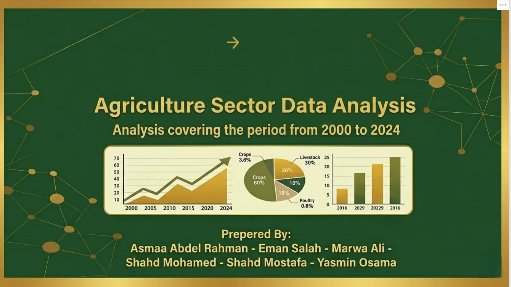
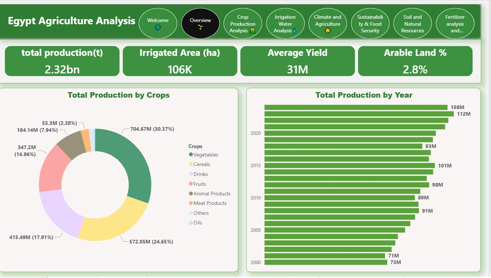
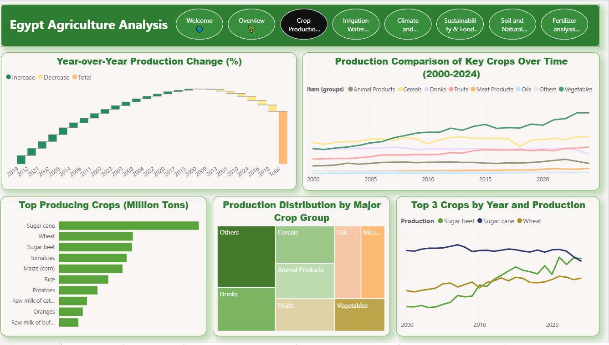
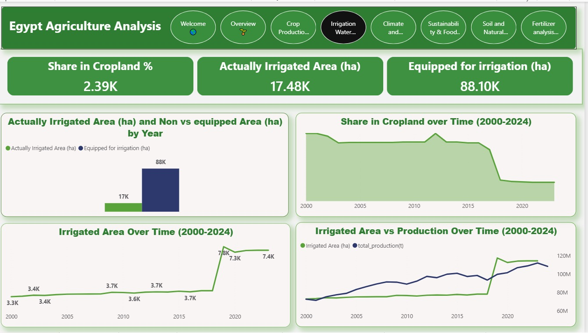
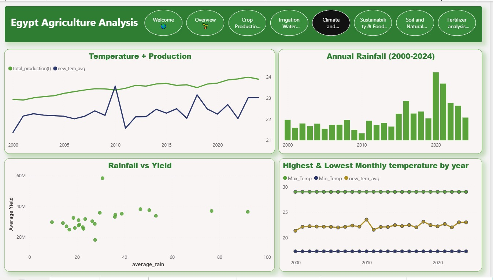
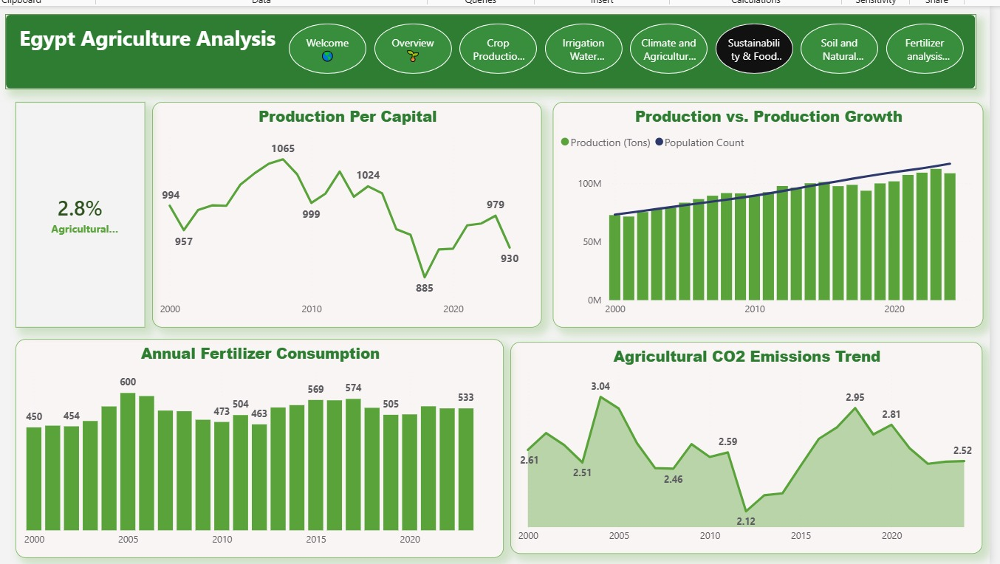
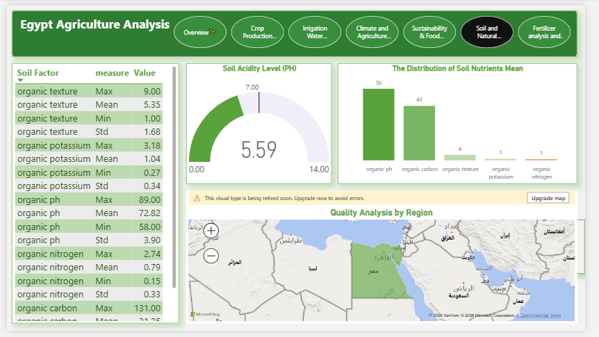
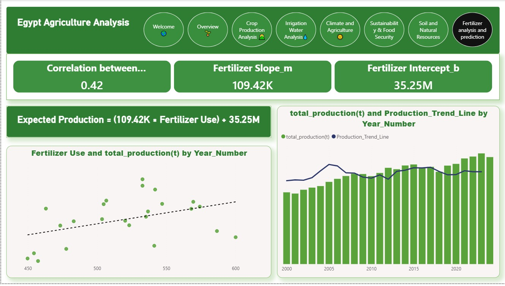

# Egypt Agricultural Indicators Analysis Dashboard (2000-2024)

> **Interactive Dashboard Preview:** Here are the key screens from the Egypt Agricultural Indicators analysis.

---

### 🔗 Detailed Insights (Page 1 - 4):

| | |
|:---:|:---:|
|  |  |
|  |  |
|  |  |
|  |  |

### 📊 Project Overview
This project delivers a comprehensive, data-driven analysis of Egypt's agricultural sector. Using **FAO datasets**, we monitored production trends, resource efficiency, and environmental impacts to provide actionable insights for sustainable development.

### 🛠️ Data Engineering & Model Optimization (Key Highlight)
* **Big Data Management:** Handled massive multi-year datasets by implementing advanced **Data Append** operations in Power Query.
* **Performance Tuning:** Consolidated multiple similar source files into streamlined tables, significantly reducing the Data Model size and enhancing dashboard responsiveness.
* **Data Cleaning:** Transformed raw CSV files into a structured Star Schema for accurate multi-dimensional analysis.

### 📈 Key Metrics & Analysis
* **Production Analysis:** Tracking *Production Per Capita (kg)* and *Average Yield* to assess food security trends.
* **Resource Management:** Monitoring *Actually Irrigated Area (ha)* and its utilization percentage relative to equipped land.
* **Environmental Footprint:** Analyzing *CO2 Emissions* alongside climate variables like *Average Temperature* and *Rainfall*.
* **Statistical Modeling:** Implementation of **Linear Regression (DAX)** to determine the correlation between *Fertilizer Use* and *Total Production*.

### 📁 Repository Structure
* **`agri_dashboard_final.pbix.zip`**: Optimized Power BI report with advanced DAX measures.
* **`agricultural_analysis_presentation.pptx`**: Professional presentation summarizing the key insights.
* **`Datasets/`**: Raw CSV files used for the analysis (Population, Land, Emissions, etc.).

### 🚀 Technical Skills Applied
* **Power BI & Power Query:** Data Transformation, Appending, and Modeling.
* **DAX:** Statistical measures (Linear Regression Slope/Intercept, Time Intelligence).
* **Data Storytelling:** Designed a corporate dark-themed UI for professional reporting.

---

### 👥 Project Team (Contributors)
This project was a collaborative effort by our dedicated team of Data Analysts:
* *Asmaa Abdelrahman*
* *eman Salah*
* *marwa Ali*
* *shahd Mohamed*
* shahd Mostafa
* ***Yasmin Osama***

---
*Prepared as part of the data analysis professional development journey.*
